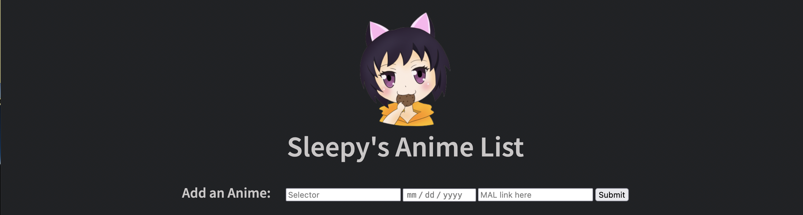

  
  
  <h2>Overview</h2>
  
  This is a full stack CRUD application. I watch anime with a group of friends every Sunday and we take turns selecting and voting on which anime to watch. I decided to create this app to keep track of all the animes we've watched together and make it easy for us to update it. I utilized the Jikan API to gather information and images on all the anime shown.
  
  <h2>How It Works</h2>
 Simply type in the name of the user, the date the anime was started, and the MyAnimeList link for the anime, press submit, and it will get entered into the database. The app will use the link to determine the MyAnimeList ID. This ID can then be used to fetch information from the Jikan API and it gets stored onto MongoDB. When the page loads, it renders everything from the database into a nice list to view and admire.
 
 
  <h2>Some Things I learned Making This Application</h2>
  
  <ul>
    <li>How to use the different methods of CRUD to get, post, update, and delete entries into the MongoDB</li>
    <li>How to use EJS templates and understand its syntax</li>
    <li>How to use async/await and promises to make the app asynchronous</li>
    <li>Better understanding of ports and localhost</li>
    <li>How to work with Node.js and use NPM to install packages and dependencies</li>
    <li>How to use axios in Node.js to fetch from an API</li>
    <li>How to host a backend server onto Heroku</li>
    <li>How to sort a list by date</li>
    <li>How to implement confirmation check for deleting lines</li>
    <li>How to add a search function to show only desired results</li>
    <li>How to use radio buttons</li>
   </ul>

<h2>Package Dependencies</h2>
axios, cors, dotenv, ejs, express, heroku, mongodb

<h2>Future Update Plans:</h2>
    <ul>
        <li>Make "currently watching" more unique</li>
        <li>Implement "sort by" option by clicking on the column heads</li>
    </ul>

<h2>Want More?</h2>
If you'd like to see more about me, please visit my <a href="https://www.linkedin.com/in/icyparkinson/">LinkedIn</a>.

If you haven't given it a look yet, check out my <a href="https://pikaclicker.netlify.app/">Pikachu Clicker</a>!
    
